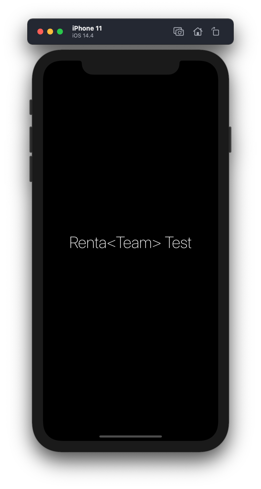
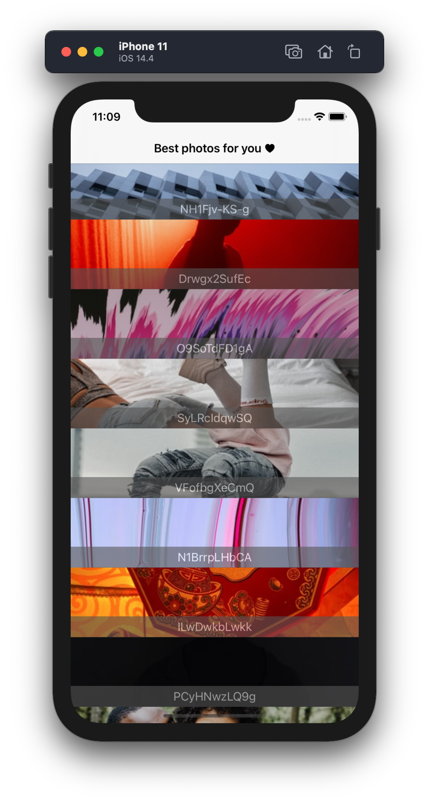
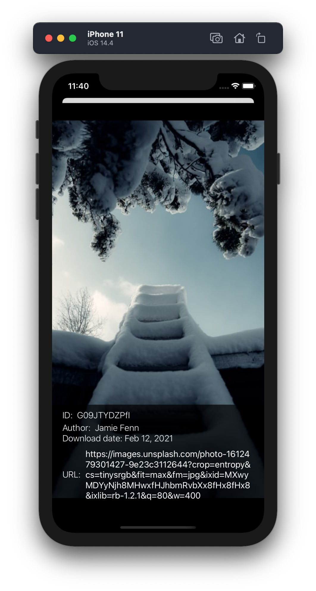

## RentaTeam-TestTask
### Задача

Написать приложение-просмотрщик картинок. Заходим в приложение, видим бесконечную ленту картинок
(каждый элемент - сама картинка + мета-информация к ней в любом виде).
При клике по картинке открываем картинку подробно, цель этого экрана - показать картинку в полном размере.
 Также на экране картинки подробно надо показать дату ее скачивания.
- Язык приложения: Swift
- Источник картинок - любое публичное АПИ
- Необходимо реализовать оффлайн-режим: приложение должно сохранять максимальную функциональность без сети (либо в случае нестабильной сети)
- Архитектура приложения - на выбор разработчика
- Использование сторонних решений приветствуется при необходимости, в этом случае нужно обоснование каждого из них (почему используется именно это решение)
- Цель приложения: минимальным количеством кода и сложности добиться качественной реализации поставленной задачи
- Непринципиальные вопросы решаются на усмотрение разработчика (с обоснованием решения, почему так), принципиальные - уточняются по почте (при их возникновении) 
- Результаты нужно разместить на любом публичном репозитории и прислать ссылку на него

## Features
- MVVM architecture
- Alamofire
- SwiftyJSON
- CoreData
- Unsplash API

JSON-Данные, которые приходят с API, довольно объемные. Я использовал SwiftyJSON, чтобы упростить код и избежать создания громоздкой модели. Также для упрощения  работы с URL-Sessions использовал Alamofire.

В приложении реализован оффлайн-режим. Если попробовать открыть приложение без подключения к интернету, то будут отображены ранее сохраненные фото.

#### Screenshots

